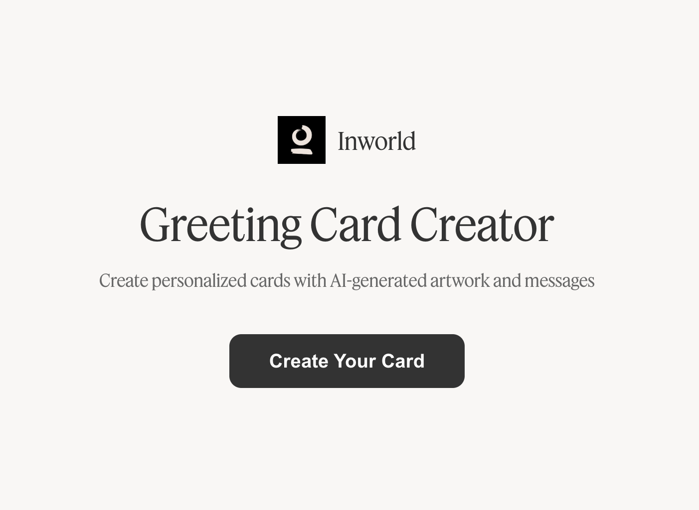

<p align="center">
  <h1 align="center">Greeting Card Creator</h1>
</p>

<p align="center">
  <a href="LICENSE"></a>
  <a href="https://inworld.ai"></a>
  <a href="https://docs.inworld.ai"></a>
</p>

Create personalized greeting cards with AI-generated messages, cover art, and voice narration. Supports birthdays, weddings, thank yous, and custom occasions—perfect for customer outreach, employee recognition, or marketing campaigns.

<p align="center">
  
</p>

## Prerequisites

- Node.js (v20 or higher)
- npm
- An [Inworld AI](https://inworld.ai) account and API key
- [Anthropic](https://console.anthropic.com) API key (for message generation)
- [Google AI](https://aistudio.google.com) API key (for image generation)

## Get Started

### Step 1: Clone the Repository

```bash
git clone https://github.com/inworld-ai/greeting-card-node.git
cd greeting-card-node
```

### Step 2: Install Dependencies

```bash
npm install
cd server && npm install
```

### Step 3: Configure Environment Variables

Create a `.env` file in the `server/` directory:

```env
INWORLD_API_KEY=your_inworld_api_key
ANTHROPIC_API_KEY=your_anthropic_api_key
GOOGLE_API_KEY=your_google_api_key
```

Get your Inworld API key from the [Inworld Portal](https://studio.inworld.ai).

### Step 4: Run the Application

For development (with auto-reload):

```bash
npm run dev:all
```

Or run frontend and backend separately:

```bash
# Terminal 1 - Backend
npm run dev:server

# Terminal 2 - Frontend
npm run dev
```

For production:

```bash
npm run build
```

## Repo Structure

```
greeting-card-node/
├── src/                  # Frontend React application
│   ├── components/       # UI components
│   └── services/         # API services (TTS, sharing)
├── server/               # Backend Express server
│   ├── components/       # Inworld Runtime SDK integration
│   └── index.ts          # API endpoints
├── public/               # Static assets (audio, fonts)
├── README.md             # Documentation
├── package.json          # Frontend dependencies
└── LICENSE               # MIT License
```

## Architecture

This template demonstrates three key Inworld technologies:

| Technology | Purpose | Endpoint |
|------------|---------|----------|
| **Inworld TTS** | Voice narration for card messages | `/api/tts` |
| **Voice Cloning API** | Custom narrator from audio sample | `/api/clone-voice` |
| **Runtime SDK** | Audio streaming & orchestration | `server/components/` |

Additional integrations:
- **Anthropic Claude** - Personalized message generation
- **Google Gemini** - AI-generated cover art

## Troubleshooting

- **Bug Reports**: [GitHub Issues](https://github.com/inworld-ai/greeting-card-node/issues)
- **General Questions**: For inquiries and support, email us at support@inworld.ai

## Contributing

We welcome contributions! Please see [CONTRIBUTING.md](CONTRIBUTING.md) for guidelines on how to contribute to this project.

## License

This project is licensed under the MIT License - see the [LICENSE](LICENSE) file for details.
